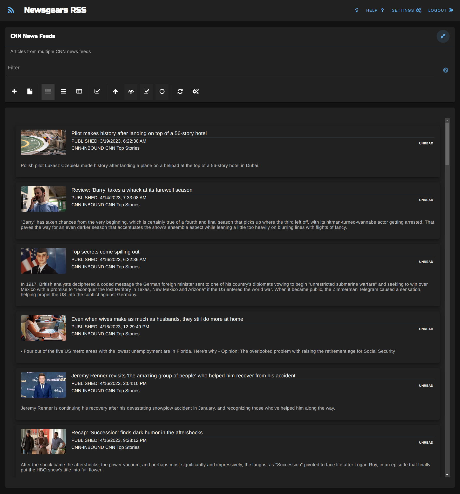

# newsgears-client 

newsgears is a multi-user, self-hosted all-in-one RSS reader/aggregator platform.

This repository contains the client application, which is a browser application used to read and share syndicated web feed content served by the Newsgears API server.  

## Project setup
```
npm install
```

### Compiles and hot-reloads for development
```
npm run devserve
```

### Compiles and minifies for production
```
npm run devbuild
```

### Unit tests
```
npm run test:unit 
```

### Lints and fixes files
```
npm run lint
```

### Customize configuration
See [Configuration Reference](https://cli.vuejs.org/config/).

### Dashboard Card (dark theme)


### Post Filter (dark theme)


### List Layout (dark theme)



### Card Layout (dark theme)


### Table Layout (dark theme)


### OPML Upload (dark theme)


### Text Post (dark theme)


### Podcast Post (dark theme)


### YouTube Video Post (dark theme)


### Image Post (/r/pics) (dark theme)


### Queue Settings 


# Copyright and License

This project is licensed under the terms of the GNU General Public License, version 3 (GPLv3).

## Copyright

Copyright (c) 2023 Lost Sidewalk Software LLC

## License

This program is free software: you can redistribute it and/or modify it under the terms of the GNU General Public License as published by the Free Software Foundation, either version 3 of the License, or (at your option) any later version.

This program is distributed in the hope that it will be useful, but WITHOUT ANY WARRANTY; without even the implied warranty of MERCHANTABILITY or FITNESS FOR A PARTICULAR PURPOSE.  See the GNU General Public License for more details.

You should have received a copy of the GNU General Public License along with this program.  If not, see [http://www.gnu.org/licenses/](http://www.gnu.org/licenses/).
