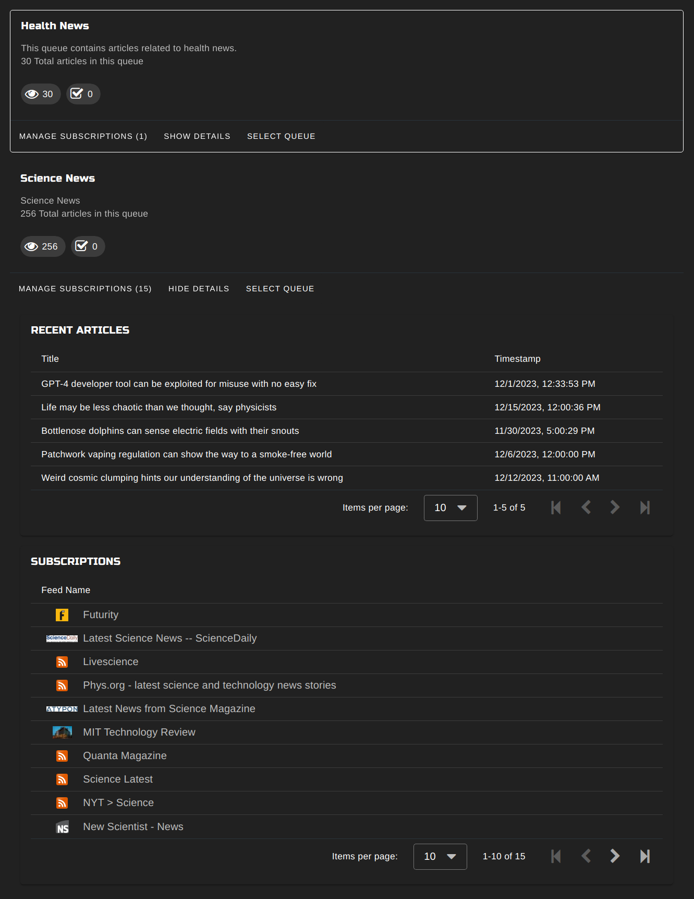
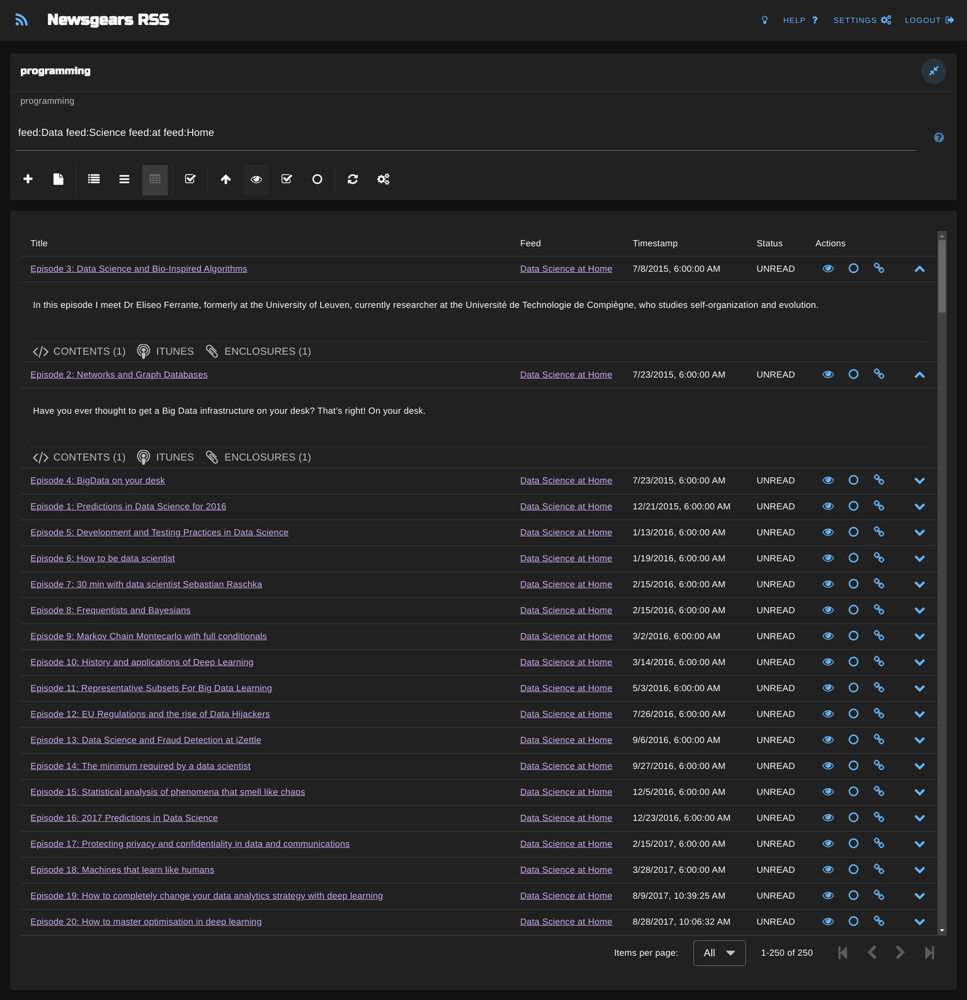
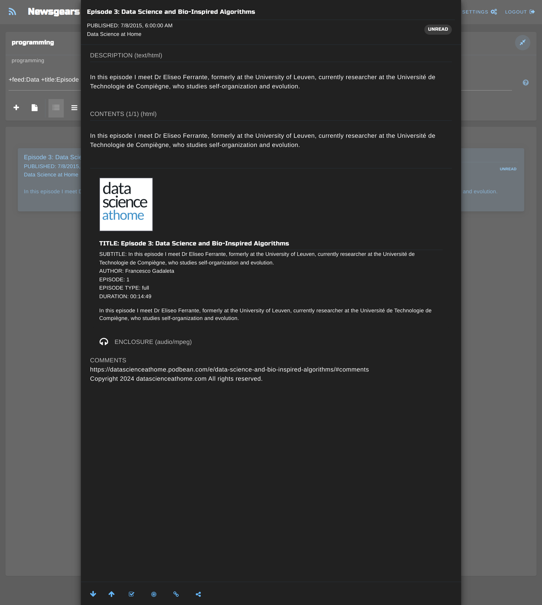

# FeedGears

## Project setup
```
npm install
```

### Compiles and hot-reloads for development
```
npm run devserve
```

### Compiles and minifies for production
```
npm run devbuild
```

### Unit tests
```
npm run test:unit 
```

### Lints and fixes files
```
npm run lint
```

### Customize configuration
See [Configuration Reference](https://cli.vuejs.org/config/).

### Dashboard Card (dark theme)



### Post Filter (dark theme)


### List Layout (dark theme)


### Card Layout (dark theme)


### Table Layout (dark theme)



### OPML Upload (dark theme)


### Text Post (dark theme)


### Podcast Post (dark theme)



### YouTube Video Post (dark theme)


### Image Post (/r/pics) (dark theme)


### Queue Settings 

